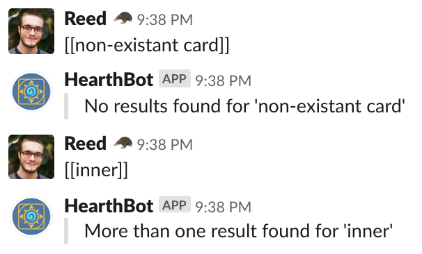

# Hearthstone Slackbot

This Slack integration is meant to provide a [Scryfall-like syntax](https://scryfall.com/docs/syntax) for retrieving Hearthstone card data.

## Usage

In the channel the application is installed into, typing any sort of query abiding by the above syntax will return card data:

If no cards are found, or there are more than one non-exact matches, you'll be told as much:

## Requirements

Three environment variables:
- BLIZZARD_ID, your Blizzard API ID
- BLIZZARD_SECRET, the secret key for your Blizzard API
- SLACK_TOKEN, the initial token for your registered Slack bot user, for OAuth

## Build

This project uses go modules for version consistency. 
To download vendor packages locally: `GO111MODULE=on go mod vendor`. 
The makefile provided should give you a good setup: `make build`.

Beyond the binary, this application is meant to be built and ran via Docker: `make docker` or `make run`

## Deploy

You can deploy as a docker container w/ your favorite method, with the three environment variables above.
