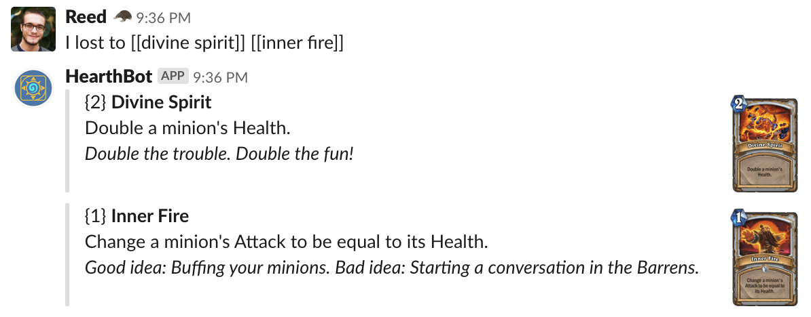

# Hearthstone Slackbot

This Slack integration is meant to provide a [Scryfall-like syntax](https://scryfall.com/docs/syntax) for retrieving Hearthstone card data.

## Usage

In the channel the application is installed into, typing any sort of query abiding by the above syntax will return card data:

If no cards are found, or there are more than one non-exact matches, you'll be told as much:

## Build

This project uses go modules for version consistency. 
To download vendor packages locally: `GO111MODULE=on go mod vendor`. 
The makefile provided should give you a good setup: `make build`.

Beyond the golang binary, this application is meant to be built and ran via Docker: `make docker`

## Deploy